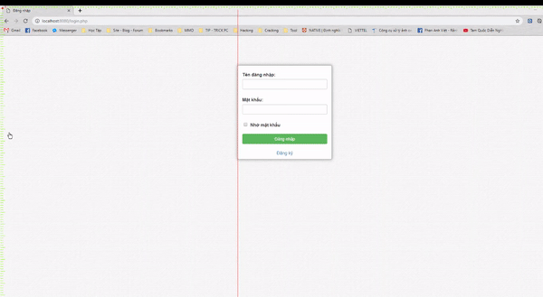
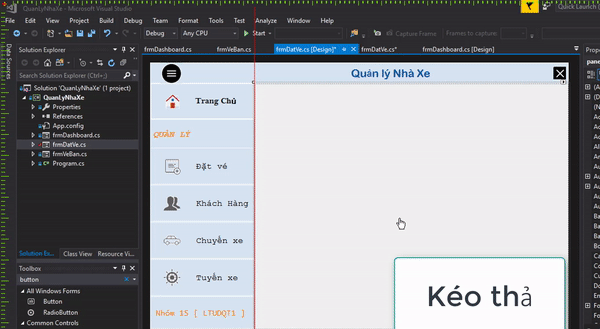

Grid Designer
------------------------------------------
_Helpful for UI/UX Designer_

Preview Software Application
------------------------------------------

Prerequisites
------------------------------------------
 - **.NET Framework:** .NET 4.6.1+
 - **Operating System:** Windows 10

Manual Hook Keys
-------------
Click on area you want and:

| Action | Description | onClick |
|:------:|:--------:|:--------:|
| ``Right Click`` | Feature | right click on ruler
| ``Double Click`` | Mi-Maximum size | click on top left (+) |
| ``Double Click`` | Select other program behind | click on main area |
| ``Keep Mouse Left`` | Moving line | click on line |
| ``Keep Mouse Right`` | Drawing rectangle | click on main area |
| ``Keep Mouse Left`` | Moving Rectangle | click on rectangle |
| ``Ctrl + Mouse Left`` | Copy Rectangle Shape | click on rectangle |
| ``Shift + Arrow ↑`` | Height --  Rectangle Shape | click on rectangle |
| ``Shift + Arrow ↓`` | Height ++  Rectangle Shape | click on rectangle |
| ``Shift + Arrow →`` | Width  ++  Rectangle Shape | click on rectangle |
| ``Shift + Arrow ←``  | Width  --  Rectangle Shape | click on rectangle |
| ``Moving Shape to ruler`` | Destroy shape | click on shape |

Features and Bugs
-------------
- [x] Create simple grid
- [x] Make survey each item
- [x] Bootstrap Grid (12 columns)
- [ ] Support Other OS and old Windows version
- [ ] Fix auto accept copy multiple Rectangle when CPU high

Authors
-------------
 - **Anhvietcr:** [fb.com/anhvietcr][committers]
 - **Buy Projects:** [anhvietcr.github.io][githubIO]

 [committers]: https://facebook.com/anhvietcr
 [githubIO]: https://anhvietcr.github.io
